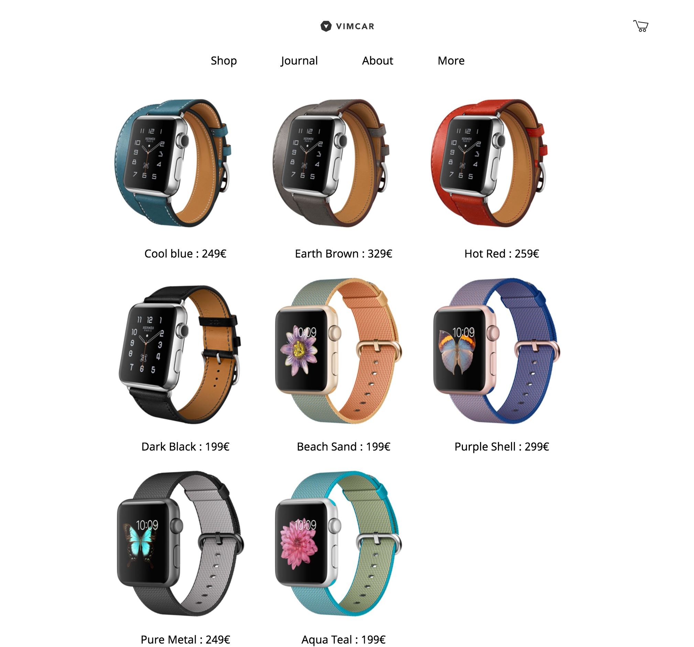

# Vimcar Coding Challenge by Gabe Rodriguez

Challenge guidelines: https://github.com/vimcar/frontend-challenge/blob/master/README.md

## Technologies used

- Angular 4
- Angular CLI
- Typescript
- Observables
- Services
- HTML/CSS

## How to run

Run `npm install` then `ng serve` and navigate to `http://localhost:4200/`. The app will automatically reload if you change any of the source files.

## Preview

